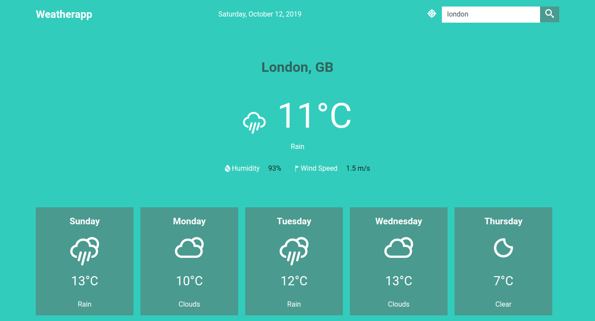

# Weather App

This app display weather data and 5 day forecast  from any city in the world using the [OpenWeatherMap](http://www.openweathermap.org/) API.

## Screenshot

## Demo
You can view the working demo here: [https://stanulilic.github.io/vanillajs-weatherapp/](https://stanulilic.github.io/vanillajs-weatherapp/)

## Features
- It can show weather by Geolocation
- It shows weather by entering the city name
- Show 5 day weather forecast of the city or geolocation

## Tools/Languages
The following are the languages or tools I used to build the app:

- Html and Css
- JavaScript(ES6+)
- [Weather icons](https://github.com/erikflowers/weather-icons)
- [Open Weather API](http://api.openweathermap.org)
